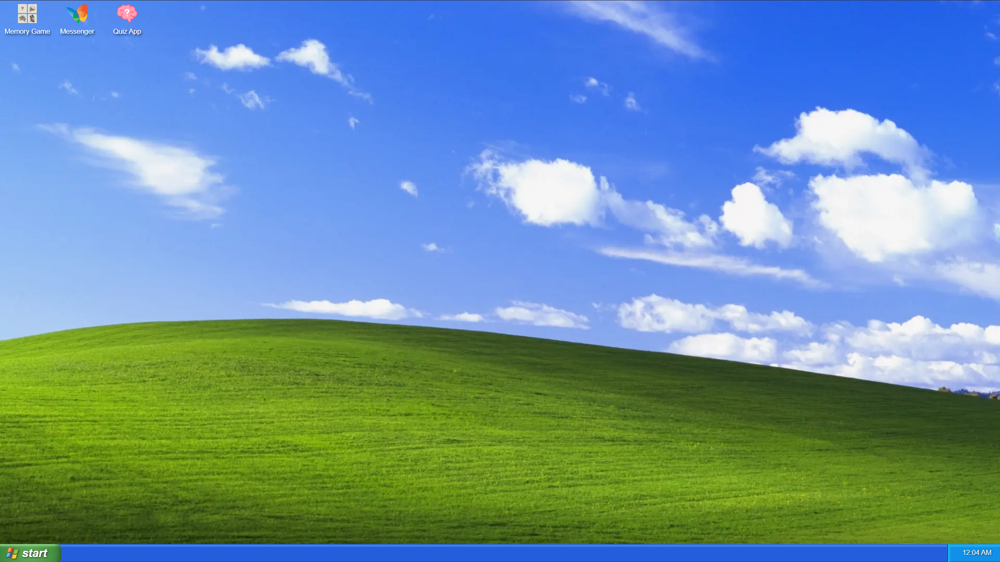
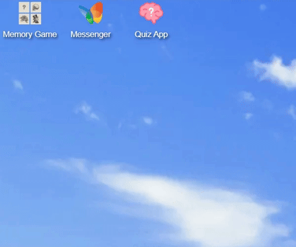
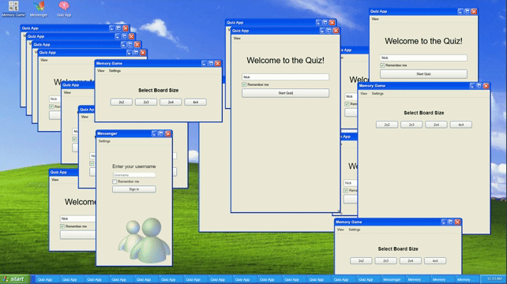

<h1>📖 Instructions</h1>

<ul>
  <li><a href="#personal-web-desktop">Personal Web Desktop</a></li>
  <ul>
    <li><a href="#desktop-grid">Desktop Grid</a></li>
    <li><a href="#windows">Windows</a></li>
  </ul>
  <li><a href="#memory-game">Memory Game</a></li>
  <li><a href="#chat-application">Chat Application</a></li>
  <li><a href="#quiz-application">Quiz Application</a></li>
</ul>

<h2 id="personal-web-desktop">🖥️ Personal Web Desktop</h2>

This is a recreation of the Windows XP Luna desktop, featuring an icon grid and a taskbar at the bottom with a working clock. The Start menu isn't available, so clicking "Start" won't do anything.

<h3 id="desktop-grid">Desktop Grid</h3>

You can move the icons around. The grid handles collisions well and stacks icons vertically if the window is resized.

<h3 id="windows">Windows</h3>

The desktop knows which window is active and only responds to key presses in that window. You can resize each window horizontally or vertically, maximize, minimize, or move them around the screen.

<h2 id="memory-game">🧠 Memory Game</h2>

<h2 id="chat-application">💬 Chat Application</h2>

<h2 id="quiz-application">❓ Quiz Application</h2>
