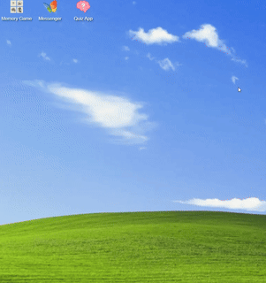
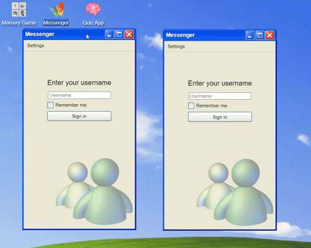
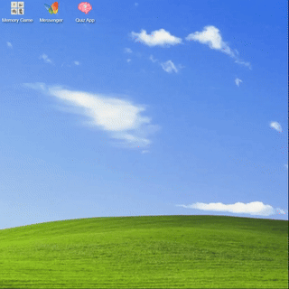

<h1>📖 Instructions</h1>

<ul>
  <li><a href="#personal-web-desktop">Personal Web Desktop</a></li>
  <ul>
    <li><a href="#desktop-grid">Desktop Grid</a></li>
    <li><a href="#windows">Windows</a></li>
  </ul>
  <li><a href="#memory-game">Memory Game</a></li>
  <li><a href="#chat-application">Chat Application</a></li>
  <li><a href="#quiz-application">Quiz Application</a></li>
</ul>

<h2 id="personal-web-desktop">🖥️ Personal Web Desktop</h2>

This is a recreation of the Windows XP Luna desktop, featuring an icon grid and a taskbar at the bottom with a working clock. The Start menu isn't available, so clicking "Start" won't do anything.

<h3 id="desktop-grid">Desktop Grid</h3>

You can move the icons around. The grid handles collisions well and stacks icons vertically if the window is resized.

<h3 id="windows">Windows</h3>

The desktop knows which window is active and only responds to key presses in that window. You can resize each window horizontally or vertically, maximize, minimize, or move them around the screen.

<h2 id="memory-game">🧠 Memory Game</h2>

First, pick and save your username. Then, choose one of 4 board sizes to play. Each board has a time limit, which is double the number of tiles. Successful games are saved to the scoreboard. The game with the fewest attempts is at the top. If multiple results have the same attempts, the faster one ranks higher.

You can also play using the keyboard. The app knows which window is focused, so keyboard inputs won't interrupt the game.

<h2 id="chat-application">💬 Chat Application</h2>

Pick and save your username, then choose a channel to connect to. There's an optional profanity filter checkbox. The filter uses ChatGPT to analyze messages, so it needs an OpenAI API key in the <code>.env</code> file. A <code>.env.example</code> file is in the <code>src/</code> directory. Note! The filter only works on incoming messages. You can still write slurs, and others without the filter will see them. You won't see inappropriate messages from yourself or others. There are 8 emojis to choose from, and the chat caches messages received while connected. It doesn't know about messages exchanged when offline.

You can open multiple chats and pretend to be different users. The chat only remembers and saves the last username entered if the <code>remember me</code> checkbox is ticked.

<h2 id="quiz-application">❓ Quiz Application</h2>

Pick and save a username. <strong>Note!</strong> In the other two apps, if you have a saved username, you go straight to the channel choice in <strong>ChatApp</strong> and board size choice in <strong>Memory Game</strong>. Here, you still see the username menu on startup, but it's filled out if you have a saved name.

After picking a username, you can take a quiz. Each question has a time limit of 10 seconds. You can use the keyboard to answer both open-ended and multiple-choice questions. You don't need to focus on the input field. Just start typing or press a number for your choice, and it will work. If you answer wrong, the quiz ends. If you answer all questions correctly, your name and time are saved to the scoreboard.

